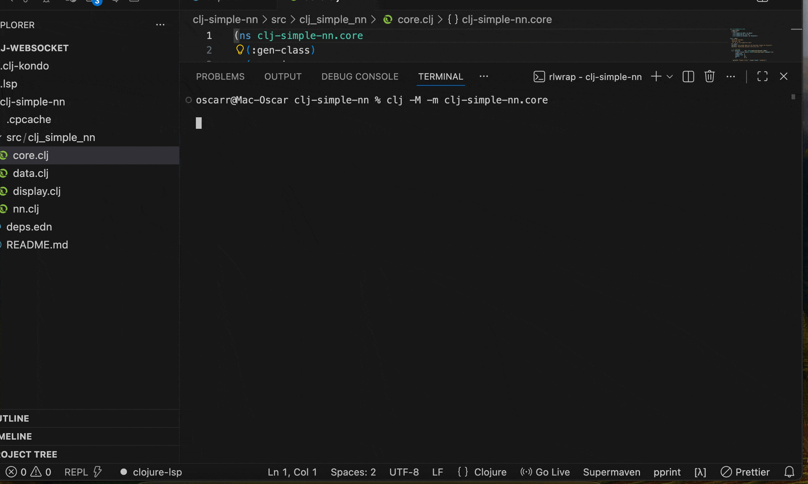

# clj-simple-nn — Red neuronal simple en Clojure

Este proyecto implementa desde cero una red neuronal feed-forward en Clojure para demostrar de manera clara, numérica y transparente cómo un modelo aprende una frontera de decisión no lineal. La red clasifica puntos 2D según si están dentro o fuera de un círculo. Es un ejemplo diseñado como proyecto de portafolio: simple, didáctico, reproducible y con una estructura idiomática en Clojure.

---

## Descripción general

El objetivo de esta demo es mostrar paso a paso el aprendizaje de una red neuronal con una arquitectura mínima:

- Entradas: 2 valores numéricos (x1, x2)
- Capa oculta: 8 neuronas con activación ReLU
- Capa de salida: 1 neurona con activación sigmoide
- Entrenamiento: descenso de gradiente estocástico (SGD)
- Función de pérdida: binary cross-entropy

La tarea del modelo es distinguir si un punto está:

- Dentro del círculo (etiqueta 1)
- Fuera del círculo (etiqueta 0)

El dataset se genera sintéticamente, por lo que el proyecto no depende de archivos externos.

---

## Características principales del proyecto

- Implementación manual de forward, backpropagation y actualización de pesos
- Métricas claras: pérdida promedio, accuracy, matriz de confusión
- Evolución visible del aprendizaje época por época
- Código modular:
  - data.clj (dataset sintético)
  - nn.clj (red neuronal)
  - display.clj (salida numérica)
  - core.clj (pipeline de entrenamiento)
- Sin dependencias externas pesadas
- Demostración ideal para reclutadores y para alguien no experto en Clojure

---

## Estructura del repositorio

```
clj-simple-nn/
  deps.edn
  README.md
  src/
    clj_simple_nn/
      core.clj
      data.clj
      nn.clj
      display.clj
```

---

## Cómo ejecutar el proyecto

Requisitos:

- Java 11+
- Clojure CLI tools instaladas

Comando para ejecutar:

```
clj -M -m clj-simple-nn.core
```

---

## Resultados del entrenamiento

Se entrenó el modelo durante 50 épocas con una tasa de aprendizaje de 0.1. Los resultados fueron los siguientes:

### Evolución durante el entrenamiento (extracto)

En las primeras épocas:

- Epoch 1  
  - Train accuracy: 80.5 % — loss: 0.5985  
  - Test accuracy: 75.0 % — loss: 0.5257

- Epoch 2  
  - Train accuracy: 92.8 % — loss: 0.3284  
  - Test accuracy: 91.5 % — loss: 0.2510

En las últimas épocas el modelo converge:

- Epoch 49  
  - Train accuracy: 98.5 %  
  - Test accuracy: 95.5 %

- Epoch 50  
  - Train accuracy: 97.8 %  
  - Test accuracy: 95.5 %

---

## Resumen final del aprendizaje

```
Train accuracy: 97.8 %    loss: 0.0586
Test  accuracy: 95.5 %    loss: 0.1348

Matriz de confusión (TEST):
TP: 68   FP: 4
TN: 123  FN: 5
```

Interpretación:

- El modelo comete solo 9 errores sobre 200 ejemplos de prueba.
- La diferencia entre entrenamiento y prueba es pequeña, señal de buena generalización.
- La red aprendió de forma estable la frontera circular del problema.

---

## Explicación didáctica para alguien no técnico

El sistema genera muchos puntos en un plano. Algunos están dentro de un círculo y otros fuera. La red neuronal ve las coordenadas de cada punto y aprende a decidir en qué categoría cae. Con cada repetición (epoch) ajusta sus parámetros para mejorar su porcentaje de aciertos. Al final logra más del 95 % de precisión.

---

## GIF demostrativo


<div align="center">
  
</div>


---

## Extensiones posibles

- Visualización de la frontera de decisión en 2D
- Conexión con datasets reales (por ejemplo, señales de trading)
- Reemplazar el dataset sintético por retornos de mercado
- Añadir tests unitarios para funciones puras

---

## Estado del proyecto

Completamente funcional y listo para demostración. Ideal como pieza de portafolio para roles de:

- Backend funcional
- Clojure development
- Data engineering
- Machine learning básico

